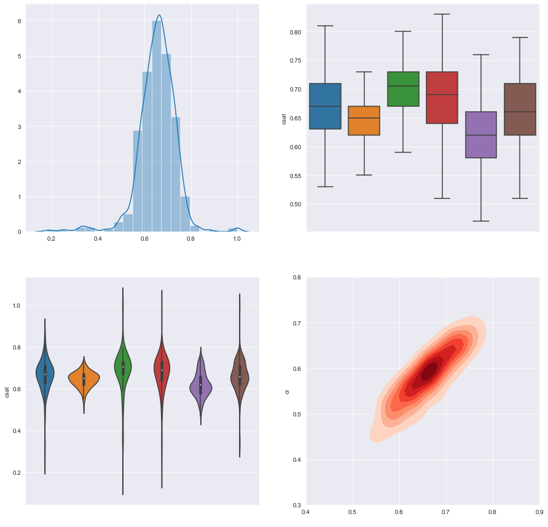

# Static KPI dashboard
This is a fun project that is the output of a python course I have finished.

  
 

  

### Installation
Clone the repository to your local machine: git clone **`https://github.com/JakubMatousek1/static-chart-dashboard
-py.git`**
Navigate to the project directory: cd static-chart-dashboard
-py.

Install the required dependencies using pip: 
 * pip install **`pandas`**
 * pip install **`seaborn`**
 * pip install **`matplotlib`**

### Usage
Run the Python script to generate several charts and in the final step select the chart you want to insert to the dashboard.

### Data
The data used in this project is arbitrary numbers of customer contacts and answered surveys in customer service.

